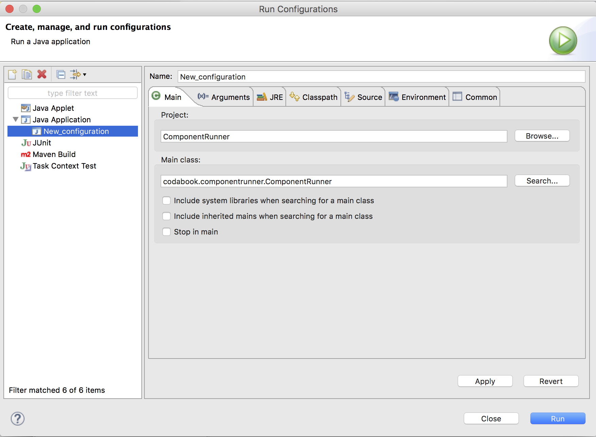
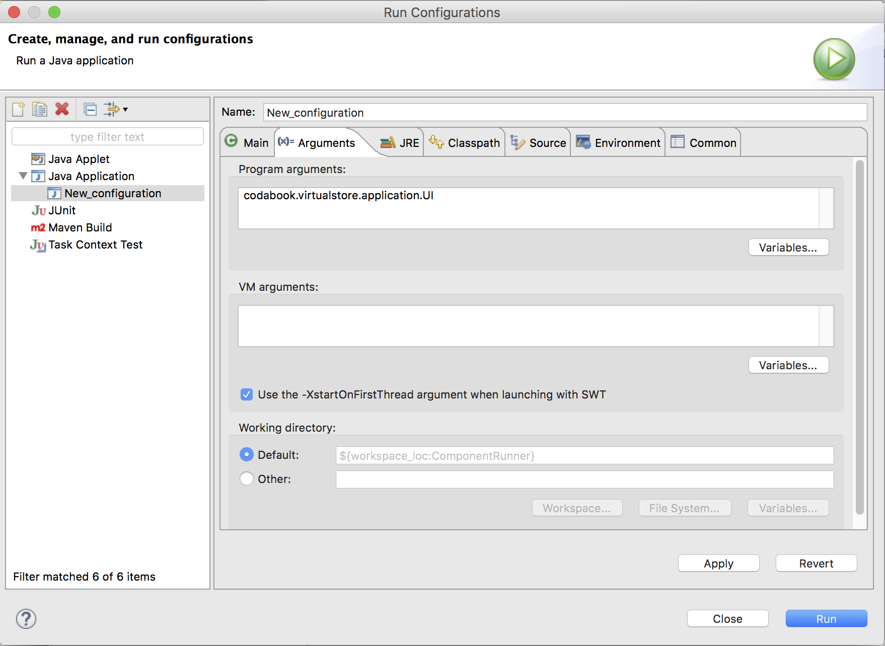
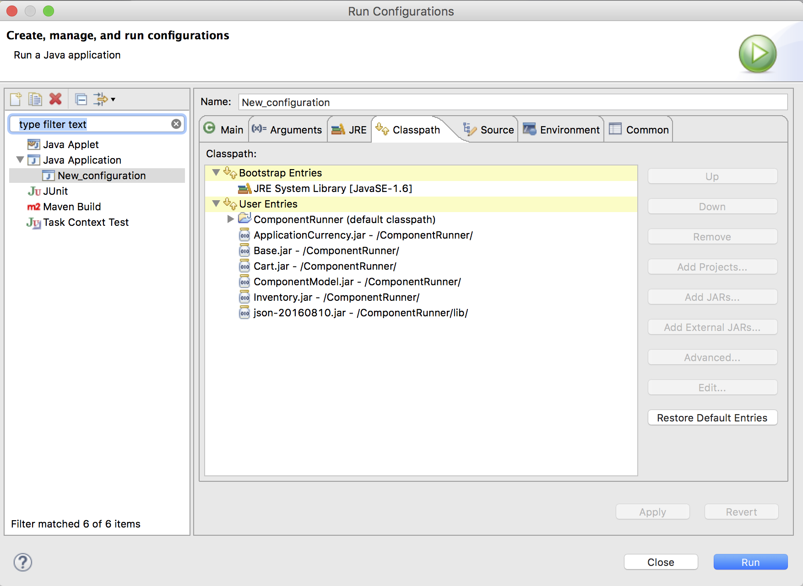

# Instruction to import in Eclipse
1. Choose 'File->Import' menu from Eclipse.
2. From the 'Import' pop-up dialog window, select 'Existing Projects into Workspace' under 'General'.  Click on 'Next' button.
3. Add files into workspace
    - ComponentModel
	- ComponentRunner
4. Select all the projects listed above and click on the 'Finish' button.
5. Selected projects get added to your Eclipse workspace.
6. From the context pop-up menu, select 'Run as -> Run Configurations' option.
7. In the pop-up dialog titled 'Run Configurations' go to 'Arguments' tab.
8. There in the 'Program Arguments' text box ,write 'codabook.virtualstore.application.UI'. This is the name of the main file of the application you want to execute.

9. Now navigate to the 'Classpath' tab in the same dialog and select 'User Entries' from the classpath list box.
10. Click on 'Add Jars' which will provide you with a jar selection dialog.Select the following jar files present in the 'ComponentRunner' project:
	- ApplicationCurrency.jar
	- Base.jar
	- Inventory.jar
	- Cart.jar
	- ComponentModal.jar
11. Click on 'Add Jars' which will provide you with a jar selection dialog.Select the following jar files present in the 'ComponentRunner/lib' project :
	- json-20160810.jar

